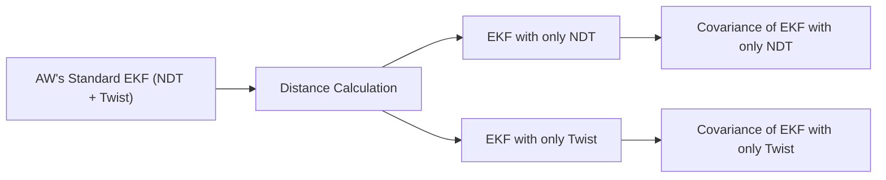

# EKF Pose Comparison
Hello, I hope it was more understandable. I added explanations to the document added by Fatih. (https://gist.github.com/xmfcx/b89ca1b07d95394faf68a07a4caa099e)

## Overview

Considering **AW's standard EKF (NDT + Twist)** as ground truth:

1. Calculated the distance of the EKF poses that work **only with NDT** and the EKF poses that work **only with Twist**, to this pose.
2. With these difference values, determined the covariance values of EKF poses that work only with **NDT** and only with **Twist**.

> **Note:** At the beginning, all poses are the same as standard AW EKF, then Twist for an EKF and NDT for another EKF are closed. You can follow the moment this change occurs on the terminal screen below.

## RVIZ Visualization

- **Red Pose**: EKF output that works only with NDT.
- **Green Pose**: EKF output that only works with twist.
- You can observe the covariance increase from the covariance ellipse formed around the poses.
    - **Purple Ellipses**: Show position errors.
    - **Yellow Ellipses**: Show orientation errors.

## Plotjuggler Data

- `covariance[0]`: Represents longitudinal error values. (in meters)
- `covariance[7]`: Represents lateral error values. (in_meters)
- `covariance[35]`: Represents yaw error values.(in_radians)
  
>**IMPORTAN NOTE:**
  The covariance values where error directly represents error values. For quick visualization, it is not calculated by squaring the error.

## Additional Resources

- [Video 1- While Turning](https://www.youtube.com/watch?v=t4xhGbE3CjM)
- [Video 2- While vehicle is driving straight](https://www.youtube.com/watch?v=FN9DlMTgXzs)
